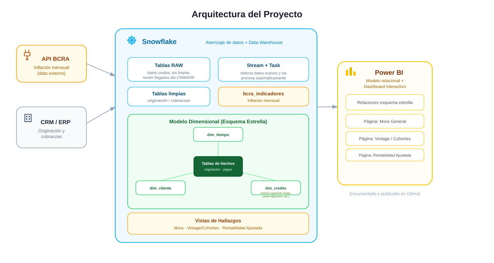

## 🏗️ Arquitectura del Proyecto

El flujo de datos de este proyecto sigue tres grandes etapas:

**CRM/ERP de la fintech → Snowflake (aterrizaje + limpieza + modelado) → Power BI (visualización)**

Snowflake cumple una doble función: es la base de datos donde aterrizan los datos crudos que genera el CRM/ERP de originación de créditos y cobranzas, 
y al mismo tiempo es el Data Warehouse donde esos datos se limpian, transforman y modelan para el análisis.

### Ingesta y actualización automática de datos

Para que el Data Warehouse se mantenga actualizado sin intervención manual a medida que la fintech genera nuevos créditos y pagos, 
se implementó un patrón de **tablas de aterrizaje (RAW) + Streams + Tasks** dentro de Snowflake:

- Los datos nuevos llegan a tablas de aterrizaje (`_raw`).
- Un **Stream** sobre cada tabla de aterrizaje detecta automáticamente qué filas son nuevas (captura de cambios).
- Una **Task** programada revisa periódicamente si el Stream tiene datos nuevos y, si los hay, ejecuta un proceso de limpieza y carga (`MERGE`) hacia las tablas finales, ya limpias y listas para el análisis.

Este mecanismo asegura que, apenas se cargan nuevos créditos o pagos, el resto del pipeline —incluyendo los hallazgos de negocio y el dashboard— se actualice de forma automática, 
sin necesidad de reprocesar nada manualmente.

### Enriquecimiento con datos externos

Además de los datos internos de la fintech, el proyecto integra una fuente de datos pública: los indicadores de inflación mensual publicados por el **BCRA (Banco Central de la República Argentina)**,
a través de su API oficial. Este dato se utiliza para calcular la rentabilidad real de la cartera de créditos, ajustada por el efecto de la inflación en el tiempo.

### Modelado dimensional

Sobre los datos limpios, se construyó un **modelo dimensional (esquema estrella)** dentro de Snowflake, separando la información en tablas de dimensiones (`dim_tiempo`, `dim_cliente`, `dim_credito`) 
y tablas de hechos (`hecho_originacion`, `hecho_pagos`). Este modelo, junto con vistas específicas para cada hallazgo de negocio, es la base sobre la que se conecta Power BI Desktop para construir el dashboard interactivo final.

### Modelo relacional en Power BI

Una vez que las tablas de dimensiones y hechos llegan a Power BI Desktop, se configuran las **relaciones entre ellas replicando el esquema estrella construido en Snowflake** (por ejemplo, `dim_credito` y `dim_tiempo`
conectadas a las tablas de hallazgos por sus respectivas claves).
Esto es lo que le da al reporte su carácter relacional: permite que los slicers y filtros aplicados sobre una dimensión —como el segmento de riesgo o el canal de originación—
se propaguen correctamente hacia todas las visualizaciones del dashboard que dependen de esos datos, en lugar de que cada gráfico funcione de forma aislada.
