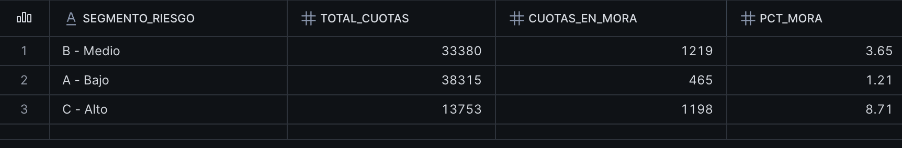
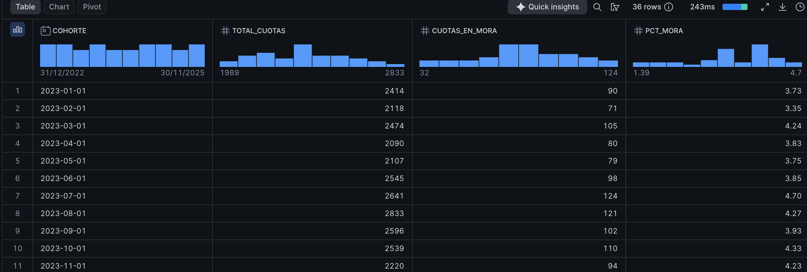
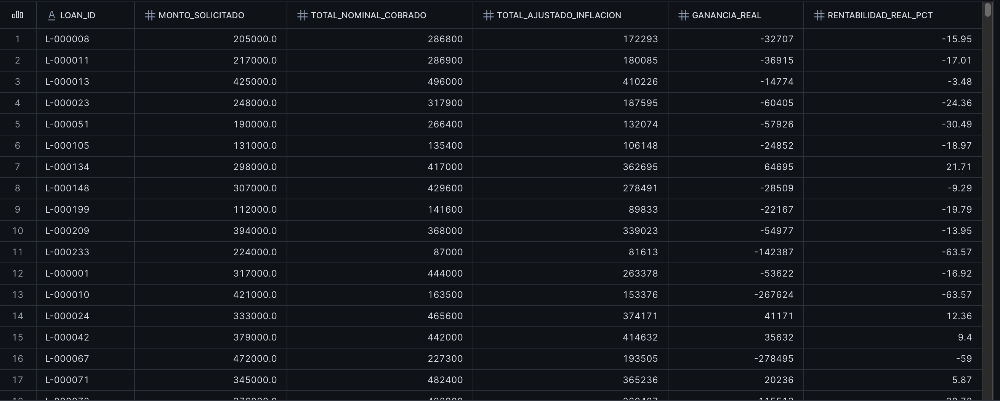

## 📊 Hallazgos de Negocio

### Hallazgo 1 — Mora por Segmento de Riesgo

**Pregunta de negocio:** ¿Cómo se comporta la mora según el segmento de riesgo del cliente?

```sql
CREATE VIEW hallazgo1_mora_por_segmento AS
SELECT
    o.segmento_riesgo,
    COUNT(*) AS total_cuotas,
    SUM(CASE WHEN c.dias_atraso > 30 THEN 1 ELSE 0 END) AS cuotas_en_mora,
    ROUND(
        SUM(CASE WHEN c.dias_atraso > 30 THEN 1 ELSE 0 END) * 100.0 / COUNT(*), 2
    ) AS pct_mora
FROM cobranzas_pagos AS c
JOIN originacion_creditos AS o
    ON c.loan_id = o.loan_id
WHERE COALESCE(c.es_cuota_futura, FALSE) = FALSE
  AND COALESCE(c.monto_pagado_inconsistente, FALSE) = FALSE
GROUP BY o.segmento_riesgo;

```


---

### Hallazgo 2 — Análisis de Cohortes (Vintage)

**Pregunta de negocio:** ¿Cómo evoluciona la mora a medida que maduran los créditos, según el mes en que fueron originados?

```sql
CREATE VIEW hallazgo2_vintage_cohortes AS
SELECT
    DATE_TRUNC('MONTH', o.fecha_solicitud) AS cohorte,
    COUNT(*) AS total_cuotas,
    SUM(CASE WHEN c.dias_atraso > 30 THEN 1 ELSE 0 END) AS cuotas_en_mora,
    ROUND(
        SUM(CASE WHEN c.dias_atraso > 30 THEN 1 ELSE 0 END) * 100.0 / COUNT(*), 2
    ) AS pct_mora
FROM cobranzas_pagos AS c
JOIN originacion_creditos AS o
    ON c.loan_id = o.loan_id
WHERE COALESCE(c.es_cuota_futura, FALSE) = FALSE
  AND COALESCE(c.monto_pagado_inconsistente, FALSE) = FALSE
GROUP BY DATE_TRUNC('MONTH', o.fecha_solicitud)
ORDER BY cohorte;
```



---

### Hallazgo 3 — Rentabilidad Real Ajustada por Inflación

**Pregunta de negocio:** ¿Cuál es la rentabilidad real de la cartera de créditos, una vez ajustada por el efecto de la inflación en el tiempo?

```sql
CREATE OR REPLACE VIEW hallazgo3_rentabilidad_ajustada(
	loan_id,
	monto_solicitado,
	total_nominal_cobrado,
	total_ajustado_inflacion,
	ganancia_real,
	rentabilidad_real_pct
) AS
WITH pagos_ajustados AS (
    SELECT
        c.loan_id,
        c.fecha_pago,
        c.monto_pagado,
        EXP(
            SUM( LN(1 + b.valor/100) )
            OVER (PARTITION BY c.loan_id ORDER BY c.fecha_pago)
        ) AS factor_acumulado
    FROM cobranzas_pagos AS c
    LEFT JOIN bcra_indicadores AS b
        ON DATE_TRUNC('MONTH', c.fecha_pago) = DATE_TRUNC('MONTH', b.fecha)
    WHERE c.monto_pagado IS NOT NULL
      AND c.fecha_pago IS NOT NULL
      AND DATE_TRUNC('MONTH', c.fecha_pago) <= (SELECT MAX(DATE_TRUNC('MONTH', fecha)) FROM bcra_indicadores)
),
totales_por_credito AS (
    SELECT
        loan_id,
        SUM(monto_pagado) AS total_nominal_cobrado,
        SUM(monto_pagado / factor_acumulado) AS total_ajustado_inflacion
    FROM pagos_ajustados
    GROUP BY loan_id
)
SELECT
    t.loan_id,
    o.monto_solicitado,
    ROUND(t.total_nominal_cobrado, 0) AS total_nominal_cobrado,
    ROUND(t.total_ajustado_inflacion, 0) AS total_ajustado_inflacion,
    ROUND(t.total_ajustado_inflacion - o.monto_solicitado, 0) AS ganancia_real,
    ROUND(
        (t.total_ajustado_inflacion - o.monto_solicitado) / o.monto_solicitado * 100, 2
    ) AS rentabilidad_real_pct
FROM totales_por_credito AS t
JOIN originacion_creditos AS o
    ON t.loan_id = o.loan_id;
```

